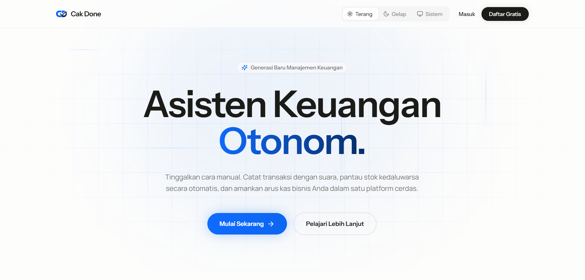
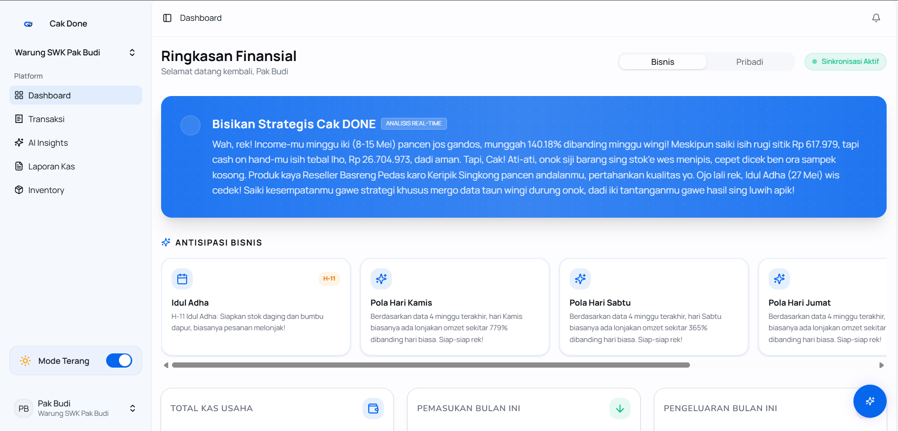
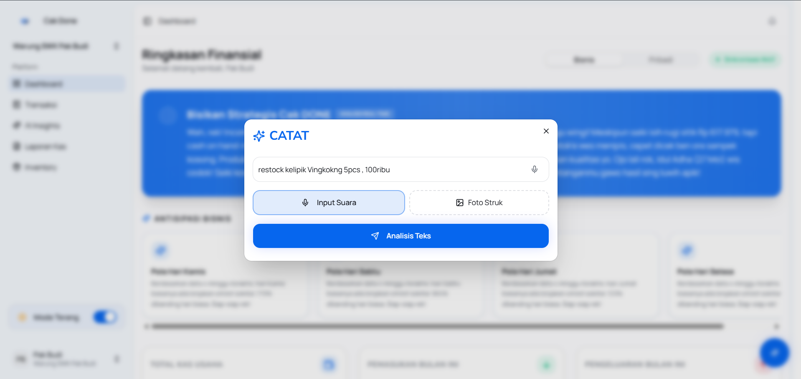
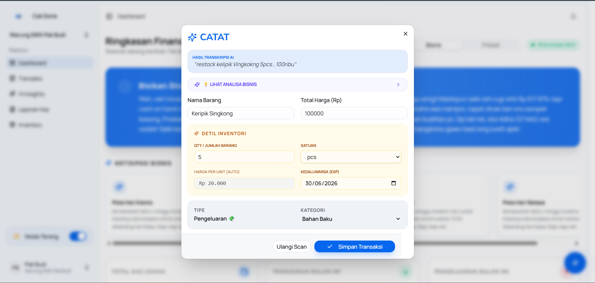
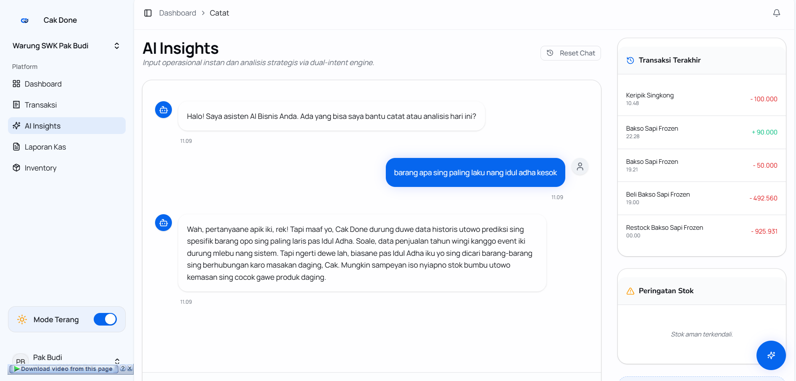
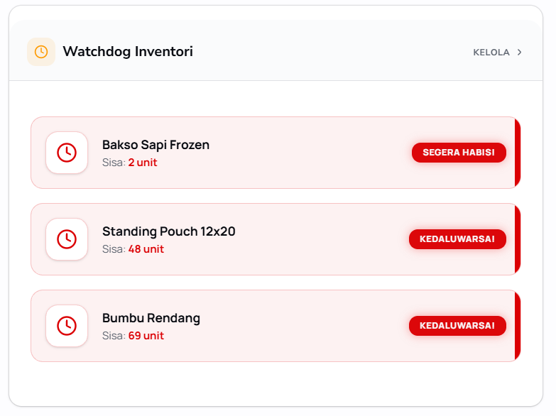
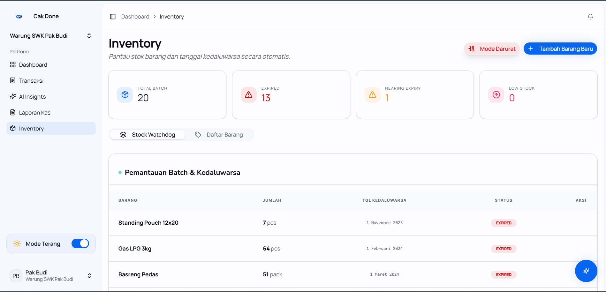

# 🛒 CAK-DONE: Smart Inventory & POS System

CAK-DONE adalah sistem manajemen inventaris dan Point of Sale (POS) mutakhir yang dirancang untuk mempermudah operasional bisnis. Dilengkapi dengan antarmuka yang modern, fitur prediksi likuiditas, manajemen stok berbasis FEFO (First Expired, First Out), mode darurat, serta pencatatan terotomatisasi yang ditenagai oleh kecerdasan buatan (AI).

---

## ✨ Fitur Utama

- 🤖 **Pencatatan Berbasis AI (Dual-Intent Architecture)**: Berinteraksi dengan sistem untuk mencatat transaksi operasional atau menanyakan *insight* bisnis via teks maupun perintah suara.
- 📦 **Manajemen Stok Cerdas (FEFO)**: Pengelolaan inventaris secara otomatis dengan memprioritaskan pengeluaran barang yang masa kedaluwarsanya paling dekat.
- 📉 **Analisis & Prediksi Likuiditas**: Pemantauan arus kas bisnis secara *real-time* dengan proyeksi masa depan untuk pengambilan keputusan yang strategis.
- 🚨 **Mode Darurat (Cooling Failure)**: Sistem mitigasi dan peringatan dini jika terjadi kegagalan pada alat penyimpanan suhu dingin (misal: Freezer rusak).
- 🔄 **Otomatisasi Pengeluaran**: Pengaturan terpusat untuk mendata dan menjadwalkan pengeluaran rutin operasional.
- 🔔 **Notifikasi Proaktif**: Dukungan *push notification* untuk memberikan laporan ringkasan harian dan peringatan kritis terkait stok dan kadaluwarsa barang.

---

## 📸 Link Deployment Aplikasi
### [Deployment Aplikasi](https://cak-done-main-r0pgr1.laravel.cloud)

## 📸 Demo Aplikasi
> *(Berikut adalah cuplikan antarmuka sistem CAK-DONE. Anda dapat mengganti placeholder
 di bawah ini dengan screenshot dari sistem aslinya)*

### 1. Landing Page CAK DONE


### 2. Dashboard & Insight Bisnis

*Menampilkan metrik utama bisnis, ringkasan arus kas, dan notifikasi pintar.*

### 3. Smart Entry AI 


*Fitur pencatatan pintar. Cukup perintahkan "Jual 5 porsi bakso" dan sistem akan memperbarui transaksi dan stok.*

### 4. AI Insight

*Fitur analisis insight. Cukup perintahkan "Berapa penjualan minggu ini?" dan sistem akan memperbarui transaksi dan stok.*

### 5. Manajemen Inventaris (Watchdog)


*Pemantauan stok barang dengan indikator visual untuk peringatan masa kedaluwarsa.*

---

## 🚀 Cara Instalasi

Ikuti langkah-langkah berikut untuk menjalankan CAK-DONE di lingkungan lokal Anda. Sistem ini dibangun di atas ekosistem **Laravel 11**, **Inertia.js (React)**, dan **Tailwind CSS**.

### Prasyarat Sistem:
- PHP 8.2 atau lebih baru
- Composer
- Node.js (v18+) & npm/Yarn
- Database (MySQL / PostgreSQL / SQLite)

### Langkah-langkah:

1. **Clone Repository**
   ```bash
   git clone https://github.com/username/cak-done.git
   cd cak-done
   ```

2. **Instalasi Dependensi**
   ```bash
   composer install
   npm install
   ```

3. **Konfigurasi Environment**
   Salin file konfigurasi bawaan dan atur variabel sesuai dengan lingkungan Anda:
   ```bash
   cp .env.example .env
   php artisan key:generate
   ```
   > **Penting**: Pastikan untuk mengisi konfigurasi kredensial layanan AI (misal Vertex AI / Gemini) dan konfigurasi VAPID untuk *Push Notification* di dalam `.env`.

4. **Migrasi dan Seeding Database**
   Siapkan skema database dan masukkan data *dummy* awal:
   ```bash
   php artisan migrate --seed
   ```

5. **Jalankan Aplikasi**
   Jalankan server backend Laravel dan Vite server secara bersamaan:
   ```bash
   # Terminal 1: Backend Server
   php artisan serve
   
   # Terminal 2: Frontend Asset Bundler
   npm run dev
   ```

6. Buka browser dan akses aplikasi melalui `http://localhost:8000`.

---

## 🧪 Akun Percobaan (User Testing)

Gunakan akun berikut untuk mencoba seluruh fitur aplikasi (sudah termasuk data historis transaksi selama 3 tahun):

- **Email**: `budi@cakdone.com`
- **Password**: `12345`
- **Role**: Pemilik Toko (Warung SWK Pak Budi)

---

## 📖 Panduan Penggunaan

1. **Autentikasi**: Login menggunakan akun administrator yang dihasilkan oleh seeder database.
2. **Pencatatan Instan**: Gunakan tombol mikrofon atau kolom teks *Smart Entry* yang tersedia di menu navigasi atas untuk mencatat transaksi dengan cepat.
3. **Manajemen Inventaris**: Akses halaman Inventaris untuk menambah batch barang baru. Sistem akan secara otomatis mengkalkulasikan harga jual berdasarkan aturan dinamis (misal: COGS * 1.2).
4. **Simulasi Darurat**: Untuk menguji fitur ketahanan operasional, admin dapat memicu mode "Cooling Failure" dari pengaturan untuk melihat bagaimana sistem merespons pengalihan penyimpanan.
5. **Analisis Laporan**: Kunjungi halaman laporan/cashflow untuk mengunduh laporan PDF bulanan atau memantau proyeksi keuangan sistem.

---

## 📞 Kontak & Lisensi

**Lisensi:**
Proyek perangkat lunak ini dilisensikan di bawah [MIT License](LICENSE). Anda diizinkan untuk memodifikasi dan mendistribusikan ulang kode sesuai ketentuan lisensi.

**Dukungan & Kontak:**
Bila Anda menemukan kendala (bug), ingin mengajukan fitur baru, atau tertarik untuk berkolaborasi, silakan hubungi tim pengembang:
- **Email**: [ghazone90@gmail.com](mailto:ghazone90@gmail.com) atau [nabhanrizqijuliansaputro@gmail.com](mailto:nabhanrizqijuliansaputro@gmail.com)

---
*Dibuat dengan ❤️ untuk mendorong kemajuan operasional UMKM secara cerdas.*
